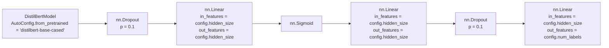
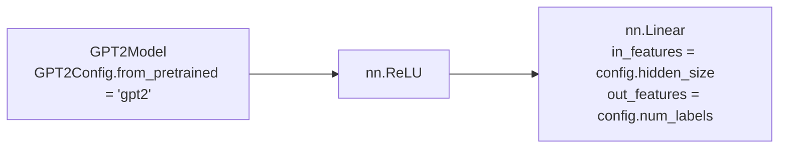

# Deep Learning in Natural Language Processing

The project was created to test various modifications for the Transformer models.

## Dataset

All four models were fine-tuned on an [arize-ai/beer_reviews_label_drift_neg](https://huggingface.co/datasets/arize-ai/beer_reviews_label_drift_neg) dataset which consists of beer reviews written in English and labels for sentiment classification.

### Data Instances

An example looks as follows.

```json
{
  "label": 2, 
  "text": "Thank you Lambicking for 12 cans of this. Truly my favorite beer. I had to review this because I had this by itself and then I've had this after drinking a couple of inferior beers. I feel like you have to drink other IPAs before this so you know what exactly you are drinking. Pine, tropical fruit, and grapefruit super strong in both taste and smell. But honestly once you drink this next to something of lesser quality you realize what you are missing. This has complexity unlike any beer I've ever had. I don't even want to comprehend not having this beer available at all times. It feels fantastic in the mouth while a burst of hop flavors is going on. By far, I can't recommend any beer more than this. The only beer I've had that comes close is Oaked Arrogant Bastard. If you can ever get this you are doing a disservice to yourself by not tasting this fantastic concoction."
}
```

### Data Fields

- `label`: indicating if the review is positive (`2`), neutral (`1`) or negative (`0`),
- `text`: the review written in English.

### Data Splits

In order to achieve better results, a second version of the dataset was created. It contains more training samples, obtained by paraphrasing some of the already existing training examples using [`ramsrigouthamg/t5-large-paraphraser-diverse-high-quality`](https://huggingface.co/ramsrigouthamg/t5-large-paraphraser-diverse-high-quality) model.

|                    | train | validation | test  |
| ------------------ | ----- | ---------- | ----- |
| default            | 9000  | 1260       | 27742 |
| paraphrased        | 11598 | 1260       | 27742 |

**Edit:** After adapting the `run_glue.py` and `run_translation.py` scripts, the dataset containing paraphrased opinions has proven redundant and has been omitted from further solutions.


## distilbert-custom

This model is a modified version of [DistilBERT](https://huggingface.co/docs/transformers/model_doc/distilbert) fine-tuned on an [arize-ai/beer_reviews_label_drift_neg](https://huggingface.co/datasets/arize-ai/beer_reviews_label_drift_neg) dataset.

It achieves the following results on the evaluation set:
- Loss: $0.7743$
- Accuracy: $0.6728$

### Model description

As mentioned, the solution is based on the DistilBERT model ([`distilbert-base-cased`](https://huggingface.co/distilbert-base-cased)). To solve the classification problem, a custom classification head was designed.

The classification head consists of the following layers:
- first dropout layer (`nn.Dropout`) taking hidden states from the DistilBERT model as an input, with probability of an element to be zeroed equal to $0.1$,
- first linear layer (`nn.Linear`) taking the output from the first dropout layer as an input and applying a linear transformation to it,
- sigmoid layer (`nn.Sigmoid`) taking the output from the first linear layer and applying the sigmoid function element-wise:
$$ \text{sigmoid}(x) = \sigma(x) = \frac{1}{1 + \exp(-x)} $$
- second linear layer (`nn.Linear`) taking the output from the sigmoid layer as an input and applying a linear transformation to it,
- second dropout layer (`nn.Dropout`) taking the output from the second linear layer with probability of an element to be zeroed equal to $0.1$,
- classifying layer (`nn.Linear`) taking the output from the second dropout layer and applying a linear transformation to it, where `out_features` parameter is equal to number of possible labels (`3`). 




### Training and evaluation data

As mentioned, the model was fine-tuned on an [arize-ai/beer_reviews_label_drift_neg](https://huggingface.co/datasets/arize-ai/beer_reviews_label_drift_neg) dataset which consists of beer reviews written in English and labels for sentiment classification.

As the model achieved satisfying results after fine-tuning on the default dataset, further training was skipped.

### Training procedure

#### Training hyperparameters

The following hyperparameters were used during training:
- learning_rate: `2e-05`
- train_batch_size: `32`
- eval_batch_size: `32`
- seed: `42`
- optimizer: `Adam` with `betas=(0.9,0.999)` and `epsilon=1e-08`
- lr_scheduler_type: `linear`
- training_steps: `2500`

#### Training results

| Training Loss | Epoch | Step | Validation Loss | Accuracy |
|:-------------:|:-----:|:----:|:---------------:|:--------:|
| 0.772         | 0.89  | 250  | 0.7742          | 0.6436   |
| 0.6519        | 1.77  | 500  | 0.7311          | 0.6533   |
| 0.5622        | 2.66  | 750  | 0.7743          | 0.6728   |
| 0.4539        | 3.55  | 1000 | 0.8498          | 0.6566   |
| 0.3941        | 4.43  | 1250 | 0.8967          | 0.6577   |
| 0.2826        | 5.32  | 1500 | 0.9745          | 0.6717   |
| 0.2707        | 6.21  | 1750 | 1.0345          | 0.6479   |
| 0.2211        | 7.09  | 2000 | 1.1089          | 0.6512   |
| 0.1886        | 7.98  | 2250 | 1.1644          | 0.6447   |
| 0.1648        | 8.87  | 2500 | 1.1786          | 0.6523   |


## gpt2-custom

This model is a modified version of [OpenAI GPT2](https://huggingface.co/docs/transformers/model_doc/gpt2) fine-tuned on an [arize-ai/beer_reviews_label_drift_neg](https://huggingface.co/datasets/arize-ai/beer_reviews_label_drift_neg) dataset.

It achieves the following results on the evaluation set:
- Loss: $0.7832$
- Accuracy: $0.6706$

### Model description

As mentioned, the solution is based on the OpenAI GPT2 model ([`gpt2`](https://huggingface.co/gpt2)). To solve the classification problem, a custom classification head was designed.

The classification head consists of the following layers:
- ReLU layer (`nn.ReLU`) taking hidden states from the `GPT2Model` as an input and applying the rectified linear unit function element-wise:
$$ \text{ReLU}(x) = (x)^+=\max(0,x) $$
- classifying layer (`nn.Linear`) taking the output from the dropout layer and applying a linear transformation to it, where `out_features` parameter is equal to number of possible labels (`3`). 



### Training and evaluation data

As mentioned, the model was fine-tuned on an [arize-ai/beer_reviews_label_drift_neg](https://huggingface.co/datasets/arize-ai/beer_reviews_label_drift_neg) dataset which consists of beer reviews written in English and labels for sentiment classification.

As the model achieved satisfying results after fine-tuning on the default dataset, further training was skipped.

### Training procedure

#### Training hyperparameters

The following hyperparameters were used during training:
- learning_rate: `2e-05`
- train_batch_size: `8`
- eval_batch_size: `8`
- seed: `42`
- optimizer: `Adam` with `betas=(0.9,0.999)` and `epsilon=1e-08`
- lr_scheduler_type: `linear`
- num_epochs: `2.0`

#### Training results

| Training Loss | Epoch | Step | Validation Loss | Accuracy |
|:-------------:|:-----:|:----:|:---------------:|:--------:|
| 0.9136        | 0.22  | 250  | 0.9541          | 0.4989   |
| 0.8128        | 0.44  | 500  | 0.8585          | 0.5896   |
| 0.7794        | 0.67  | 750  | 0.8244          | 0.5940   |
| 0.7577        | 0.89  | 1000 | 0.8127          | 0.6317   |
| 0.6688        | 1.11  | 1250 | 0.7978          | 0.6447   |
| 0.6164        | 1.33  | 1500 | 0.8430          | 0.6393   |
| 0.6266        | 1.56  | 1750 | 0.8324          | 0.6544   |
| 0.6239        | 1.78  | 2000 | 0.7810          | 0.6652   |
| 0.6386        | 2.0   | 2250 | 0.7832          | 0.6706   |


## t5-custom

This model is a modified version of [T5](https://huggingface.co/docs/transformers/model_doc/t5) fine-tuned on an [arize-ai/beer_reviews_label_drift_neg](https://huggingface.co/datasets/arize-ai/beer_reviews_label_drift_neg) dataset.

It achieves the following results on the evaluation set:
- Loss: $0.5035$
- Bleu: $18.4904$
- Accuracy: $1.0$
- Gen Len: $2.121$

### Model description

As mentioned, the solution is based on the T5 model ([`t5-base`](https://huggingface.co/t5-base)). To solve the classification problem, it was treated as a seq2seq problem, where the first sequence was the review text and the second was the label. In addition, the weights of the layers, whose indices were not equal to successive elements of the Fibonacci sequence, were frozen.

### Training and evaluation data

As mentioned, the model was fine-tuned on an [arize-ai/beer_reviews_label_drift_neg](https://huggingface.co/datasets/arize-ai/beer_reviews_label_drift_neg) dataset which consists of beer reviews written in English and labels for sentiment classification.

As the model achieved satisfying results after fine-tuning on the default dataset, further training was skipped.

### Training procedure

#### Training hyperparameters

The following hyperparameters were used during training:
- learning_rate: `5e-05`
- train_batch_size: `8`
- eval_batch_size: `8`
- seed: `42`
- optimizer: `Adam` with `betas=(0.9,0.999)` and `epsilon=1e-08`
- lr_scheduler_type: `linear`
- num_epochs: `1.0`

#### Training results

| Training Loss | Epoch | Step | Validation Loss | Bleu    | Accuracy | Gen Len |
|:-------------:|:-----:|:----:|:---------------:|:-------:|:--------:|:-------:|
| 0.6066        | 0.22  | 250  | 0.5035          | 18.4904 | 1.0      | 2.121   |
| 0.4373        | 0.44  | 500  | 0.4795          | 18.6545 | 1.0      | 2.121   |
| 0.445         | 0.67  | 750  | 0.4560          | 18.96   | 1.0      | 2.121   |
| 0.4386        | 0.89  | 1000 | 0.4507          | 19.0721 | 1.0      | 2.121   |


## flan-t5

The following solution presents results obtained by [FLAN-T5](https://huggingface.co/docs/transformers/model_doc/flan-t5) model on an [arize-ai/beer_reviews_label_drift_neg](https://huggingface.co/datasets/arize-ai/beer_reviews_label_drift_neg) dataset.

By using `text2text-generation` pipeline, the model achieves accuracy of $0.7611$ on the evaluation set and $0.7269$ on the test set.


### Training and evaluation data

As mentioned, the model was fine-tuned on an [arize-ai/beer_reviews_label_drift_neg](https://huggingface.co/datasets/arize-ai/beer_reviews_label_drift_neg) dataset which consists of beer reviews written in English and labels for sentiment classification.

#### Data Fields

- `text`: the review written in English with question ` Is this a positive, neutral or negative review?` in the end.

#### Data Splits

|                    | train | validation | test  |
| ------------------ | ----- | ---------- | ----- |
| default            | 9000  | 1260       | 27742 |

### Training procedure

#### Training hyperparameters

The following hyperparameters were used during training:
- learning_rate: 5e-05
- train_batch_size: 8
- eval_batch_size: 8
- seed: 42
- optimizer: Adam with betas=(0.9,0.999) and epsilon=1e-08
- lr_scheduler_type: linear
- num_epochs: 1.0