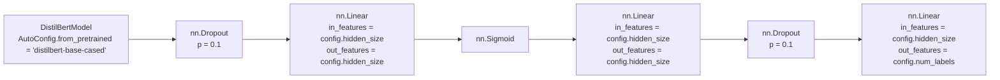

# distilbert-custom

This model is a modified version of [DistilBERT](https://huggingface.co/docs/transformers/model_doc/distilbert) fine-tuned on an [arize-ai/beer_reviews_label_drift_neg](https://huggingface.co/datasets/arize-ai/beer_reviews_label_drift_neg) dataset.

It achieves the following results on the evaluation set:
- Loss: $0.7743$
- Accuracy: $0.6728$

## Model description

As mentioned, the solution is based on the DistilBERT model ([`distilbert-base-cased`](https://huggingface.co/distilbert-base-cased)). To solve the classification problem, a custom classification head was designed.

The classification head consists of the following layers:
- first dropout layer (`nn.Dropout`) taking hidden states from the DistilBERT model as an input, with probability of an element to be zeroed equal to $0.1$,
- first linear layer (`nn.Linear`) taking the output from the first dropout layer as an input and applying a linear transformation to it,
- sigmoid layer (`nn.Sigmoid`) taking the output from the first linear layer and applying the sigmoid function element-wise:
$$ \text{sigmoid}(x) = \sigma(x) = \frac{1}{1 + \exp(-x)} $$
- second linear layer (`nn.Linear`) taking the output from the sigmoid layer as an input and applying a linear transformation to it,
- second dropout layer (`nn.Dropout`) taking the output from the second linear layer with probability of an element to be zeroed equal to $0.1$,
- classifying layer (`nn.Linear`) taking the output from the second dropout layer and applying a linear transformation to it, where `out_features` parameter is equal to number of possible labels (`3`). 

## Training and evaluation data

As mentioned, the model was fine-tuned on an [arize-ai/beer_reviews_label_drift_neg](https://huggingface.co/datasets/arize-ai/beer_reviews_label_drift_neg) dataset which consists of beer reviews written in English and labels for sentiment classification.

### Data Fields

- `label`: indicating if the review is positive (`2`), neutral (`1`) or negative (`0`),
- `text`: the review written in English.

### Data Splits

As the model achieved satisfying results after fine-tuning on the default dataset, further training was skipped.

|                    | train | validation | test  |
| ------------------ | ----- | ---------- | ----- |
| default            | 9000  | 1260       | 27742 |

## Training procedure

### Training hyperparameters

The following hyperparameters were used during training:
- learning_rate: `2e-05`
- train_batch_size: `32`
- eval_batch_size: `32`
- seed: `42`
- optimizer: `Adam` with `betas=(0.9,0.999)` and `epsilon=1e-08`
- lr_scheduler_type: `linear`
- training_steps: `2500`

### Training results

| Training Loss | Epoch | Step | Validation Loss | Accuracy |
|:-------------:|:-----:|:----:|:---------------:|:--------:|
| 0.772         | 0.89  | 250  | 0.7742          | 0.6436   |
| 0.6519        | 1.77  | 500  | 0.7311          | 0.6533   |
| 0.5622        | 2.66  | 750  | 0.7743          | 0.6728   |
| 0.4539        | 3.55  | 1000 | 0.8498          | 0.6566   |
| 0.3941        | 4.43  | 1250 | 0.8967          | 0.6577   |
| 0.2826        | 5.32  | 1500 | 0.9745          | 0.6717   |
| 0.2707        | 6.21  | 1750 | 1.0345          | 0.6479   |
| 0.2211        | 7.09  | 2000 | 1.1089          | 0.6512   |
| 0.1886        | 7.98  | 2250 | 1.1644          | 0.6447   |
| 0.1648        | 8.87  | 2500 | 1.1786          | 0.6523   |
