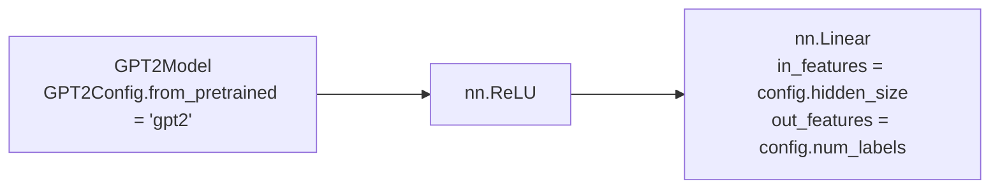

# gpt2-custom

This model is a modified version of [OpenAI GPT2](https://huggingface.co/docs/transformers/model_doc/gpt2) fine-tuned on an [arize-ai/beer_reviews_label_drift_neg](https://huggingface.co/datasets/arize-ai/beer_reviews_label_drift_neg) dataset.

It achieves the following results on the evaluation set:
- Loss: $0.7832$
- Accuracy: $0.6706$

## Model description

As mentioned, the solution is based on the OpenAI GPT2 model ([`gpt2`](https://huggingface.co/gpt2)). To solve the classification problem, a custom classification head was designed.

The classification head consists of the following layers:
- ReLU layer (`nn.ReLU`) taking hidden states from the `GPT2Model` as an input and applying the rectified linear unit function element-wise:
$$ \text{ReLU}(x) = (x)^+=\max(0,x) $$
- classifying layer (`nn.Linear`) taking the output from the dropout layer and applying a linear transformation to it, where `out_features` parameter is equal to number of possible labels (`3`). 

## Training and evaluation data

As mentioned, the model was fine-tuned on an [arize-ai/beer_reviews_label_drift_neg](https://huggingface.co/datasets/arize-ai/beer_reviews_label_drift_neg) dataset which consists of beer reviews written in English and labels for sentiment classification.

### Data Fields

- `label`: indicating if the review is positive (`2`), neutral (`1`) or negative (`0`),
- `text`: the review written in English.

### Data Splits

As the model achieved satisfying results after fine-tuning on the default dataset, further training was skipped.

|                    | train | validation | test  |
| ------------------ | ----- | ---------- | ----- |
| default            | 9000  | 1260       | 27742 |

## Training procedure

### Training hyperparameters

The following hyperparameters were used during training:
- learning_rate: `2e-05`
- train_batch_size: `8`
- eval_batch_size: `8`
- seed: `42`
- optimizer: `Adam` with `betas=(0.9,0.999)` and `epsilon=1e-08`
- lr_scheduler_type: `linear`
- num_epochs: `2.0`

### Training results

| Training Loss | Epoch | Step | Validation Loss | Accuracy |
|:-------------:|:-----:|:----:|:---------------:|:--------:|
| 0.9136        | 0.22  | 250  | 0.9541          | 0.4989   |
| 0.8128        | 0.44  | 500  | 0.8585          | 0.5896   |
| 0.7794        | 0.67  | 750  | 0.8244          | 0.5940   |
| 0.7577        | 0.89  | 1000 | 0.8127          | 0.6317   |
| 0.6688        | 1.11  | 1250 | 0.7978          | 0.6447   |
| 0.6164        | 1.33  | 1500 | 0.8430          | 0.6393   |
| 0.6266        | 1.56  | 1750 | 0.8324          | 0.6544   |
| 0.6239        | 1.78  | 2000 | 0.7810          | 0.6652   |
| 0.6386        | 2.0   | 2250 | 0.7832          | 0.6706   |